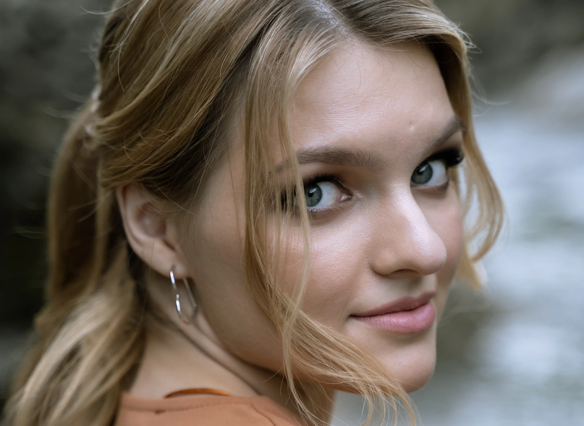

Hi dear friend!

I'm Anastasia and I'm a photographer. I speak Russian, German and English. Currently I live in Germany, Berlin, sometimes I come to Russia to my family, so I can take orders in Russia as well. I have always loved photographing people, nature and architecture, especially when traveling, because photography is a card with a memory of a place, event, a certain moment in life. Photos can store the most beautiful memories and moments of our lives, as well as people who were with us, and my task is to save these moments for you!
Types of photo-shooting I provide: lifestyle, family, children, love-story, beauty, creative shooting, portraits and subject shooting.

In the summer of 2021, I finally fulfilled my dream and graduated from photography courses in my hometown. I also took course "studio light" and master class "Photoshop for a photographer".
All my photos are taken with love and soul. I would love to be your photographer!
